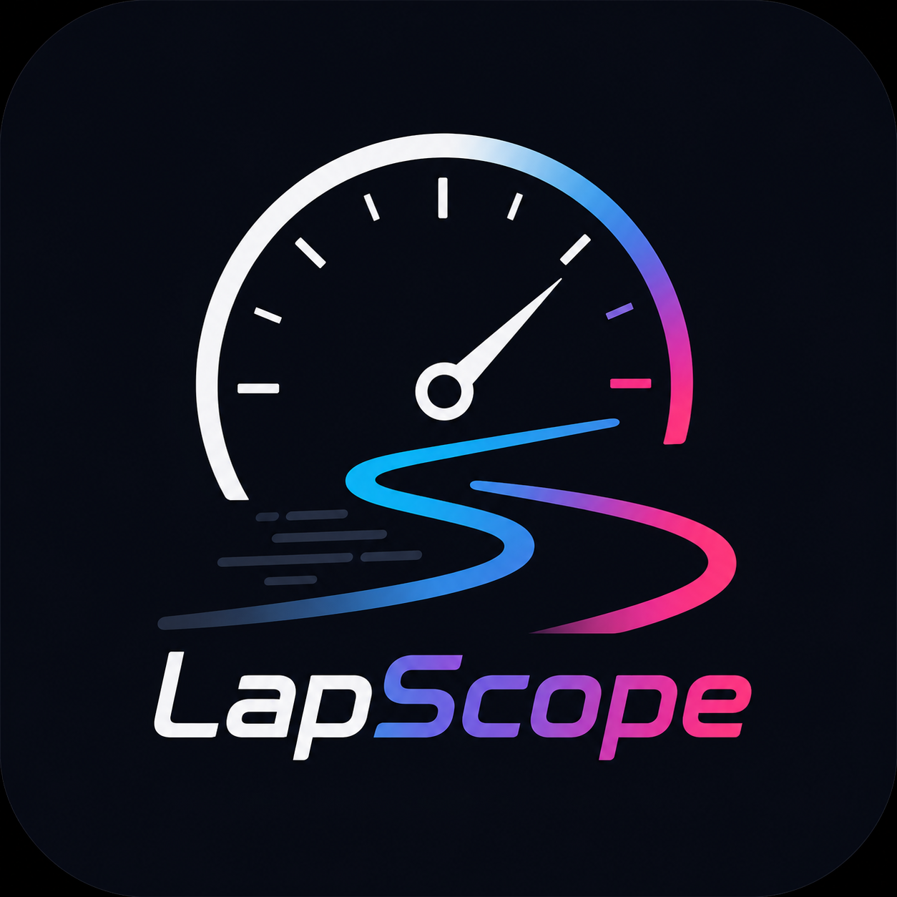
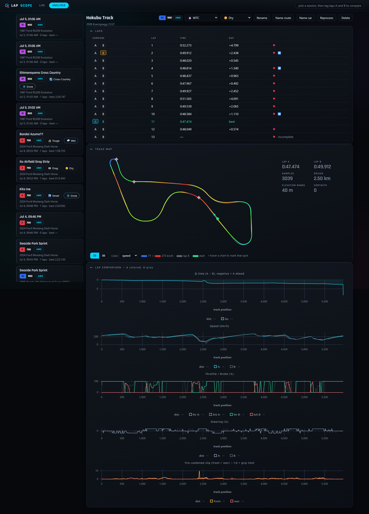
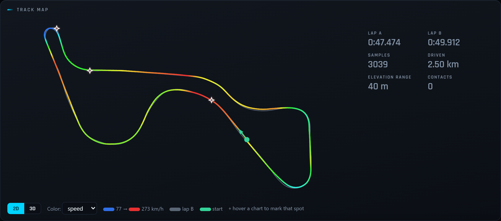
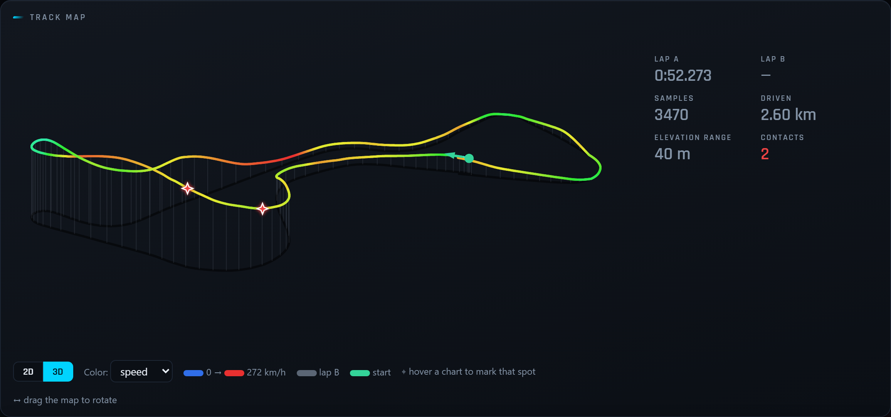
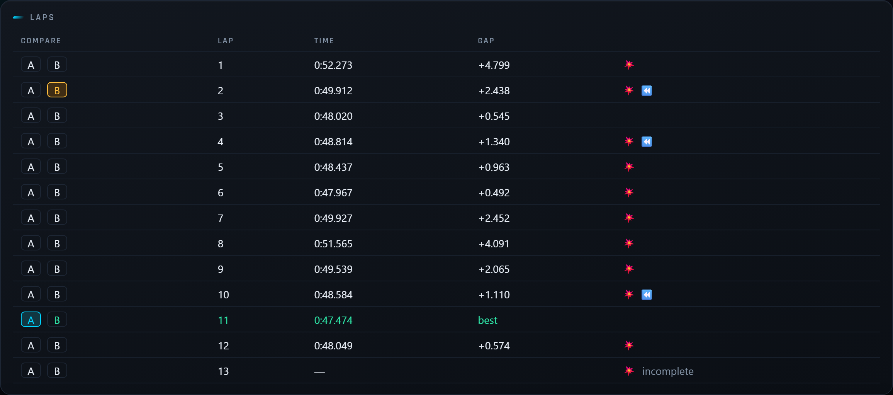
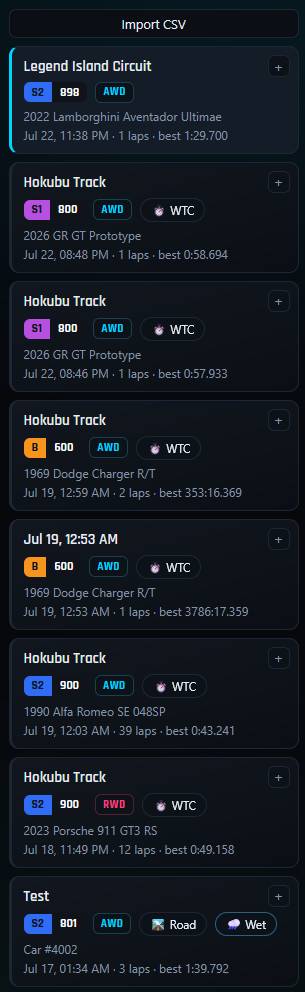
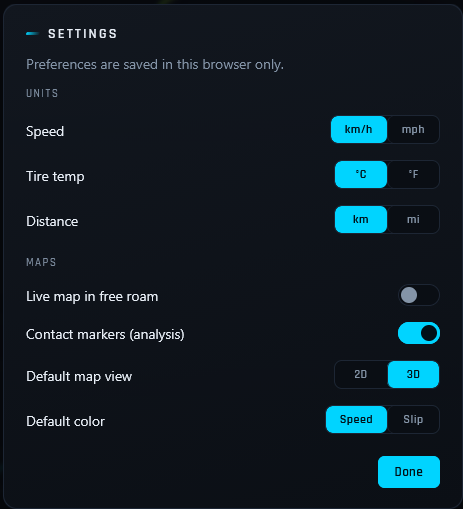
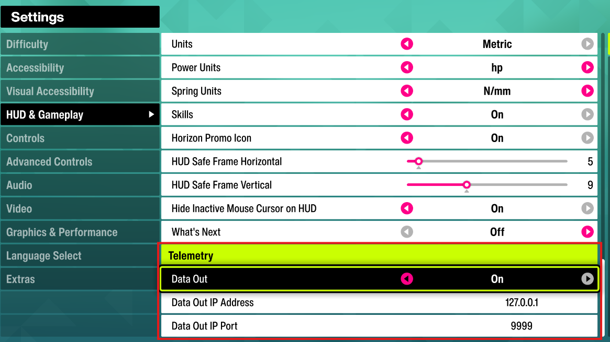

<div align="center">



<!-- # LapScope -->

**A self-hosted telemetry dashboard and lap analyzer for Forza Horizon 6.**

Runs on your own PC, reads the game's official "Data Out" UDP stream, and turns it
into a live driving dashboard plus a searchable history of every lap you drive — so
you can see *where* you're losing time and *why*.

[](../../releases)
[](../../actions/workflows/ci.yml)
[](LICENSE)


</div>

---

## What it is

LapScope listens for Forza Horizon 6's "Data Out" telemetry, shows it live in your
browser, and records timed drives to a local database so you can analyze and compare
laps afterwards. It's a single app you run locally — no cloud, no account, your data
stays on your machine.

The game only broadcasts *your* car (no rival data), so LapScope measures you against
your own best lap and the tires' grip limit — which is exactly what makes you faster
in Rivals.

## Features

- **Live dashboard** — speed / RPM / gear gauges, a friction circle (G-forces),
  per-tire grip (green = grip, red = sliding), an understeer/oversteer indicator,
  throttle/brake/steering traces, a lap timer with a **live delta vs. your
  session-best lap**, and a **track map that draws itself as you drive** — it survives
  a mid-race pause (photo mode included) and marks contacts and jumps as they happen.
- **Lap analysis** — every timed drive is stored. Browse sessions, see lap times, draw
  your **racing line colored by speed or tire slip**, and **compare two laps (A vs. B)**
  with distance-aligned charts: time delta, speed, inputs, steering, and slip. The map
  has a **2D/3D toggle** (3D uses elevation and is drag-to-rotate). **Drag-zoom any
  chart** and every chart follows while the map **highlights exactly that stretch of
  road** (double-click to reset).
- **Jumps, drawn as jumps** — airborne stretches are detected from suspension + tire
  load and drawn as an explicit **takeoff ○ → touchdown ▸ flight line** on both maps;
  a hard landing gets an amber glow + impact ring instead of being mistaken for a crash.
- **Dirty-lap flags** — the packet has no "lap invalidated" field, so LapScope infers
  it: ⏪ **rewind** (the lap clock ran backwards) and 💥 **contact** (a G-spike beyond
  what tires can generate). Rewound stretches are trimmed from the charts and map.
- **Automatic event detection** — races, Rivals, sprints, drags, touge,
  cross-country, and **World Time Attack** are each detected and timed correctly, even
  though the game never labels them (it doesn't even count the last lap of a race).
  Free-roam cruising is discarded automatically, so the list stays clean.
- **Session metadata** — Forza-colored class/PI ribbons (incl. the new **R class**),
  drivetrain badges, car names (bundled community ordinal list + your overrides),
  auto-detected wet conditions, and a track-type tag.
- **Routes** — the game never sends route names, so circuits are fingerprinted from lap
  geometry. Name a route once and every past and future session on it picks it up.
- **Settings** — a ⚙ **Settings** panel (top-right on both pages) to switch units —
  **speed** (km/h ↔ mph), **tire temp** (°C ↔ °F), **distance** (km ↔ mi) — plus map
  preferences (draw the live map in free roam, show/hide analysis contact markers,
  default 2D/3D view and color-by). Preferences are saved in your browser.

**Analysis — A/B lap comparison** (distance-aligned delta, speed, inputs, steering, slip):



**Track map**, colored by speed — the same real circuit in 2D and in 3D. The 3D view uses
the packet's elevation and is drag-to-rotate; the ✦ markers are detected contacts:





**Lap list with dirty-lap flags** (💥 contact, ⏪ rewind) and A/B compare tags:



**Session list** — every drive with Forza-colored class/PI, drivetrain, track-type, and
conditions ribbons, plus the auto-named route:





## Quick start

### Windows (recommended — plug and play)

1. Download the latest **`LapScope-<version>-win64.zip`** from the
   [Releases page](../../releases).
2. Unzip it anywhere and double-click **`LapScope.exe`**.
3. Your browser opens automatically at **http://127.0.0.1:8000**. Leave the little
   console window running while you play.

> If the build isn't code-signed yet, Windows SmartScreen may warn on first run —
> click **More info → Run anyway**. Every release lists SHA256 checksums, and you
> can rebuild and verify the download yourself: see [docs/BUILDING.md](docs/BUILDING.md).
>
> LapScope also shows a dismissible "newer version available" notice in the
> dashboard when a newer GitHub release exists (it never auto-downloads).

### Docker (power / cross-platform users)

```bash
docker compose up --build -d
```

Then open **http://localhost:8000**.

### In Forza Horizon 6 (required either way)

Turn on Data Out under **`Settings → HUD and Gameplay`**:

| Setting             | Value       |
|---------------------|-------------|
| Data Out            | `ON`        |
| Data Out IP Address | `127.0.0.1` |
| Data Out IP Port    | `9999`      |

Then just drive. Telemetry is only sent while you're driving (not in menus). You'll see
**"Waiting for telemetry…"** until the first packet arrives.

> ⚠️ Do **not** use ports **5200–5300** — the game binds its own socket in that range.



## Try it without the game

No FH6 handy? A built-in simulator replays realistic telemetry so you can see the whole
app work end to end:

```bash
python tools/simulator.py                                   # ~3.5 laps, 1 event
python tools/simulator.py --freeroam 20 --events 2 --wet    # full feature test
python tools/simulator.py --duration 180 --dirty            # contact + rewind flags
python tools/simulator.py --race 3 --duration 200           # a race with a real finish
python tools/simulator.py --sprint 75 --jumps               # point-to-point + jumps
```

The live dashboard moves immediately; a session with laps appears on the Analysis page
~15 s after the simulator finishes.

## Troubleshooting

**No packets arriving?** Most common on Microsoft Store / Xbox-app (UWP) builds, which
can be blocked from sending to `127.0.0.1`:

1. Try `127.0.0.1:9999` first — it's officially supported by FH6.
2. If nothing arrives, use your PC's **LAN IP** instead (`ipconfig` → e.g.
   `192.168.1.20`), keeping port `9999`.
3. Check the server actually sees packets at **http://localhost:8000/api/status**.

The full flow — UWP loopback exemptions, the Docker IPv6-proxy port bug, and diagnosing
an **event type that isn't being recorded** (with `LS_KEEP_DISCARDED` and
`tools/inspect_session.py`) — lives in the **[Wiki](../../wiki)**.

## Configuration

| Env var              | Default     | Meaning                                    |
|----------------------|-------------|--------------------------------------------|
| `TELEMETRY_UDP_PORT` | `9999`      | UDP port the listener binds                |
| `DATA_DIR`           | `/app/data` | Where `telemetry.db` is written            |
| `LS_KEEP_DISCARDED`  | `0`         | `1` = keep sessions with no completed laps |

Recordings are raw 324-byte packets (~70 MB per hour of driving). Delete sessions from
the Analysis page to reclaim space. The Windows exe stores its DB in
`%LOCALAPPDATA%\LapScope` and serves on `127.0.0.1:8000`.

## How it works

```
FH6 ──UDP 9999──▶ asyncio listener ──▶ parser (324-byte Data Out packet)
                                      ├──▶ WebSocket /ws/live ──▶ live dashboard
                                      └──▶ session/lap tracker ──▶ SQLite ──▶ REST /api ──▶ analysis page
```

It's a single FastAPI app with a vanilla-JS frontend (no build step). Packet layout
reference: [FH6 Data Out documentation](https://support.forza.net/hc/en-us/articles/51744149102611-Forza-Horizon-6-Data-Out-Documentation).

The interesting part is that FH6 gives *no* explicit event boundaries, no lap-invalidated
flag, and no route names, and `DistanceTraveled` isn't even in meters on real circuits —
so LapScope infers all of it from packet behavior. The deep dive (packet internals,
event-detection model, the hard-won FH6 quirks) is in the **[Wiki](../../wiki)** and
[AGENTS.md](AGENTS.md).

## Contributing

[Issues](../../issues) and PRs welcome — especially **captures of event types that
aren't detected yet** and **car-ordinal additions**. Start with
[CONTRIBUTING.md](CONTRIBUTING.md) (workflow, branch rules, how to file a capture);
see [ARCHITECTURE.md](ARCHITECTURE.md) for the code map, [AGENTS.md](AGENTS.md) for
the dev workflow, and our [Code of Conduct](CODE_OF_CONDUCT.md).

## License

[MIT](LICENSE) © 2026 Erdem Darcan.

### Third-party assets

- **[Rajdhani](https://fonts.google.com/specimen/Rajdhani)** display font — SIL Open
  Font License 1.1 (vendored in `app/static/fonts`).
- **[uPlot](https://github.com/leeoniya/uPlot)** charting library — MIT (vendored for
  the analysis page).

### Code signing

Windows releases are code-signed with a free code-signing certificate generously
provided by [SignPath Foundation](https://signpath.org/), using code-signing
infrastructure by [SignPath.io](https://about.signpath.io/).

> LapScope is an unofficial, fan-made tool and is not affiliated with or endorsed by
> Playground Games, Turn 10, or Microsoft. "Forza Horizon" is a trademark of Microsoft.
